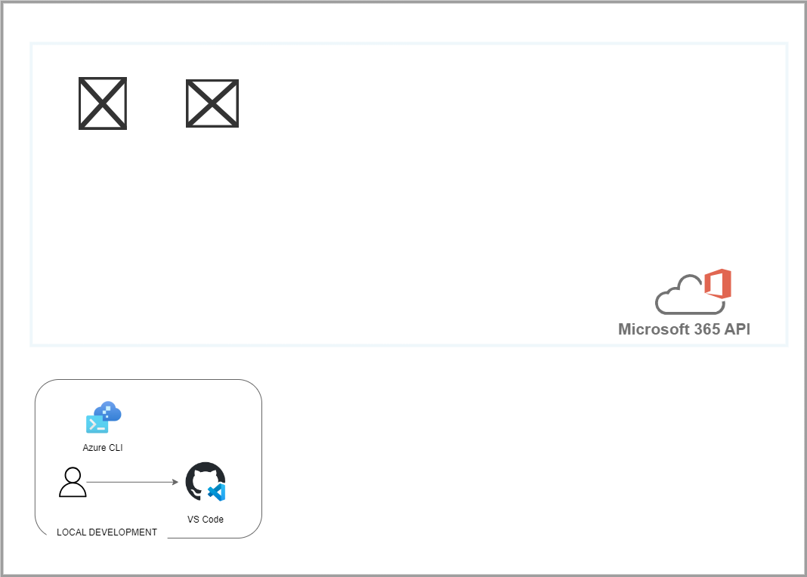

# Customer Lens

Example project to demonstrate:

* MS Graph API

## Architecture Diagram



# Prerequisites

- Azure Subscription
- Azure CLI
- GitHub Account

## Install Azure CLI

```bash
# Check if installed
az --version

# Install azure cli
curl -sL https://aka.ms/InstallAzureCLIDeb | sudo bash

az --version
```

## Create System Identities

The solution uses two system identities.

| System Identities        | Authentication                                             | Authorization                                                                                                                                                                  | Purpose                                                                                                                                                                                               |
| ------------------------ | ---------------------------------------------------------- | ------------------------------------------------------------------------------------------------------------------------------------------------------------------------------ | ----------------------------------------------------------------------------------------------------------------------------------------------------------------------------------------------------- |
| `env.APP_CLIENT_NAME`    | ClientID and Client Secret                                 | Microsoft Graph API permissions: <ul><li>Read User.ReadBasic.All</li></ul>                                                                                                     | Uses the identity package to obtain an access token from the Microsoft Identity platform.<br>The access token is used as a bearer token to authenticate the user when calling the Microsoft Graph API |

Configure the environment variables. Copy `example.env` to `.env` and update the values

```bash
# load .env vars (optional)
[ ! -f .env ] || export $(grep -v '^#' .env | xargs)

# Create app system identity
./script/create_app_sp
# Adds APP_CLIENT_ID=$created_clientid to .env
# Adds APP_CLIENT_SECRET=$created_secret to .env
```

# Development

You'll need to set up a development environment if you want to develop a new feature or fix issues. The project uses a docker based devcontainer to ensure a consistent development environment.
* Open the project in VSCode and it will prompt you to open the project in a devcontainer. This will have all the required tools installed and configured.

## Setup local dev environment

If you want to develop outside of a docker devcontainer you can use the following commands to setup your environment.

* Install Python
* Install Azure CLI
* Configure linting and formatting tools

```bash
# Configure the environment variables. Copy `example.env` to `.env` and update the values
cp example.env .env

# load .env vars
[ ! -f .env ] || export $(grep -v '^#' .env | xargs)
# or this version allows variable substitution and quoted long values
[ -f .env ] && while IFS= read -r line; do [[ $line =~ ^[^#]*= ]] && eval "export $line"; done < .env

# Create and activate a python virtual environment
python3 -m venv .venv
source .venv/bin/activate

# Install python requirements
pip install -r ./requirements_dev.txt

# Configure Azure CLI and authenticate
curl -sL https://aka.ms/InstallAzureCLIDeb | sudo bash
# login to azure cli
az login --tenant $TENANT_ID

# Configure linting and formatting tools
sudo apt-get update
sudo apt-get install -y shellcheck
pre-commit install
```

## Testing
Ideally, all code is checked to verify the following:

All the unit tests pass All code passes the checks from the linting tools To run the linters, run the following commands:

```bash
# Use pre-commit scripts to run all linting
pre-commit run --all-files

# Run a specific linter via pre-commit
pre-commit run --all-files codespell

# Run linters outside of pre-commit
codespell .
shellcheck -x ./script/*.sh

# Check for window line endings
find **/ -not -type d -exec file "{}" ";" | grep CRLF
# Fix with any issues with:
# sed -i.bak 's/\r$//' ./path/to/file
# Or Remove them
# find . -name "*.Identifier" -exec rm "{}" \;
```

# Architecture Decisions


# References
